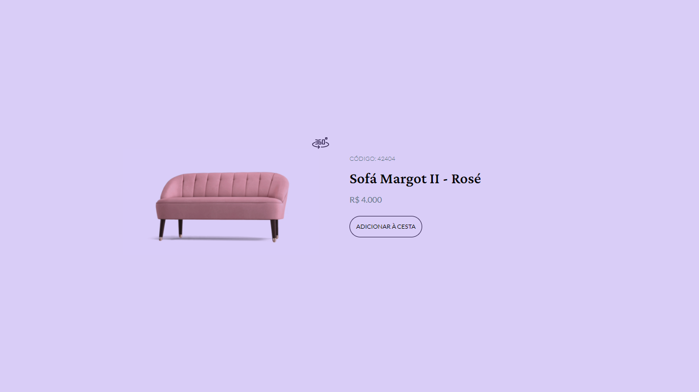

<h1 align="center"> Desafio 2 </h1>

Desafios exclusivos, promovido pela Rockeseat.  

  

 

  

## 🚀 Tecnologias

Esse projeto foi desenvolvido com as seguintes tecnologias:

- React
- Typescript
- Tailwindcss
- Git e Github

## 💻 Projeto

Este projeto é o desafio 2 dos challengers semanais da Rocketseat #boraCodar

- [Acesse o projeto finalizado, online](https://challenger-2-bora-codar.vercel.app)

## 🔖 Layout

Você pode visualizar o layout do projeto através [DESSE LINK](https://www.figma.com/file/OYd0aWyvnxLtiXCw6ioxDK/%23boraCodar---Desafio-2-(Community)). É necessário ter conta no [Figma](https://figma.com) para acessá-lo.

## :memo: Licença

Esse projeto está sob a licença MIT.
